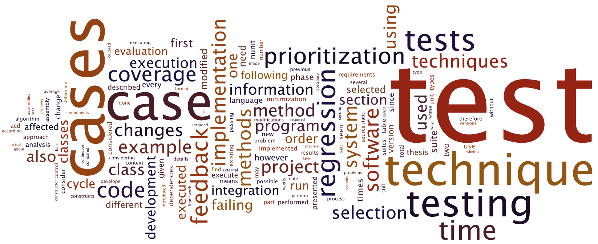

# Master's Thesis

This repository contains source code and artifacts for my master's thesis.  
See the respective directories for source code, related files, and more details.

Feel free to contact me with your questions; constructive criticism is appreciated.

## Abstract

Software is continually and rapidly evolving with constant risk of introducing faults. Software testing has long been used to aid in the detection of faults, and agile development strategies have been driving the use of automated tests and regression testing specifically. As development continues, test suites eventually grow in the number of test cases to the extent that the execution time is extensive. When it has increased to the point that it prevents efficient software engineering, a regression testing technique is required to reduce the feedback cycle times - the times for receiving feedback from tests on changes.

This thesis has investigated regression testing techniques presented in previous research. The focus has been on *test case selection* techniques - for selecting a subset of all test cases for execution - and *test case prioritization* techniques - for determining the execution order of test cases. With some evaluation criteria in mind, a safe modification-based selection and prioritization technique was chosen and a proof-of-concept implementation was developed. First, the implemented technique was evaluated for robustness using an example application. Following, a case study was conducted on an existing software development project, where the perceived problems with regression testing were documented by interviewing a software developer. The technique was then integrated with the project's existing regression testing and its efficiency was evaluated.

It was concluded that a regression testing technique is, to some extent, practical to implement, although difficult to verify for complete correctness. Empirical evaluations in the case study showcased reduced feedback cycle times of 60% or more compared to when not using the technique - assuming a uniform distribution of failing test cases. However, it was stated as important to evaluate the efficiency of the technique on a per-project basis.

